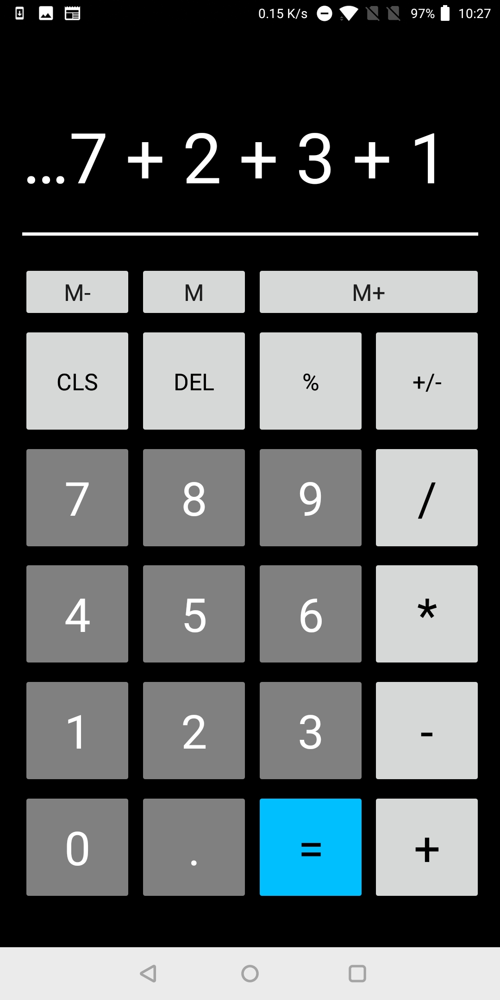
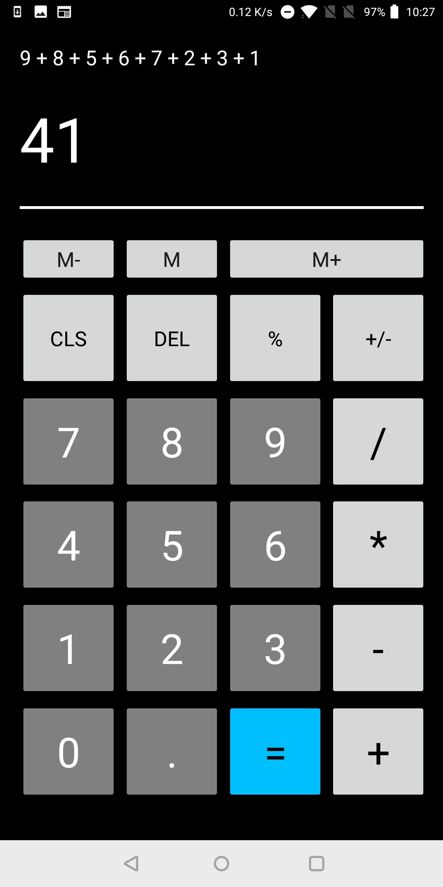
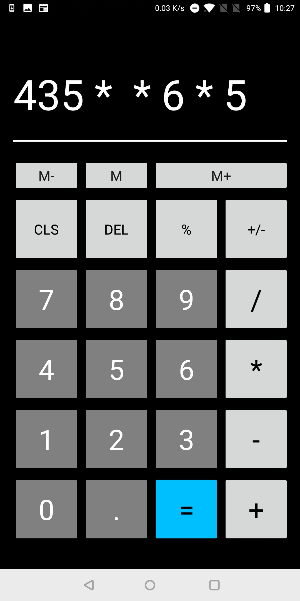
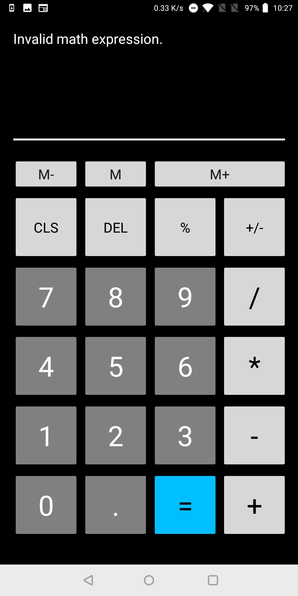

# SimpleCalculator
A nice and simple Android calculator designed to get some experience with using XAML and Xamarin.Forms. Also had the opportunity to do some debugging using Xamarin Live Player (when it decided to work) which is good get the app up and running very quickly.

    

